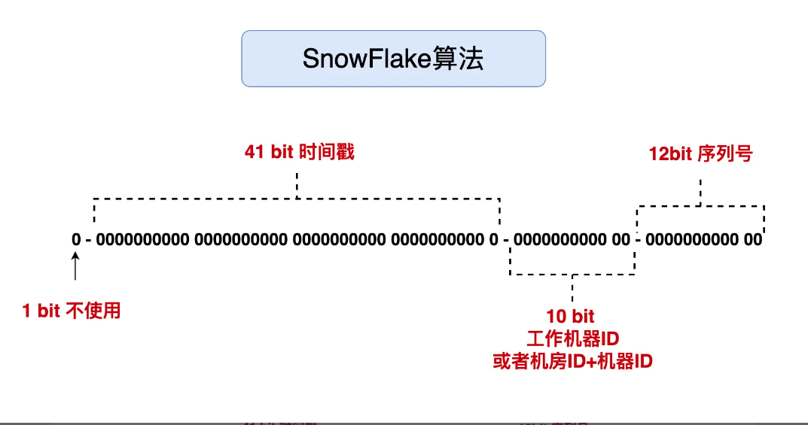

# SnowFlake


## SnowFlake算法

> 据国家大气研究中心的查尔斯·奈特称，一般的雪花大约由10^19个水分子组成。在雪花形成过程中，会形成不同的结构分支，所以说大自然中不存在两片完全一样的雪花，每一片雪花都拥有自己漂亮独特的形状。雪花算法表示生成的id如雪花般独一无二。
>
> snowflake是Twitter开源的分布式ID生成算法，结果是一个long型的ID。其核心思想是：使用41bit作为毫秒数，10bit作为机器的ID（5个bit是数据中心，5个bit的机器ID），12bit作为毫秒内的流水号（意味着每个节点在每毫秒可以产生 4096 个 ID），最后还有一个符号位，永远是0。


核心思想：分布式，唯一。


## 算法具体介绍


雪花算法是 64 位 的二进制，一共包含了四部分：

- 1位是符号位，也就是最高位，始终是0，没有任何意义，因为要是唯一计算机二进制补码中就是负数，0才是正数。
- 41位是时间戳，具体到毫秒，41位的二进制可以使用69年，因为时间理论上永恒递增，所以根据这个排序是可以的。
- 10位是机器标识，可以全部用作机器ID，也可以用来标识机房ID + 机器ID，10位最多可以表示1024台机器。
- 12位是计数序列号，也就是同一台机器上同一时间，理论上还可以同时生成不同的ID，12位的序列号能够区分出4096个ID。





### 优化

由于41位是时间戳，我们的时间计算是从1970年开始的，只能使用69年，为了不浪费，其实我们可以用时间的相对值，也就是以项目开始的时间为基准时间，往后可以使用69年。获取唯一ID的服务，对处理速度要求比较高，所以我们全部使用位运算以及位移操作，获取当前时间可以使用`System.currentTimeMillis()`。


### 时间回拨问题

在获取时间的时候，可能会出现`时间回拨`的问题，什么是时间回拨问题呢？就是服务器上的时间突然倒退到之前的时间。

1. 人为原因，把系统环境的时间改了。
2. 有时候不同的机器上需要同步时间，可能不同机器之间存在误差，那么可能会出现时间回拨问题。


**解决方案**

1. 回拨时间小的时候，不生成 ID，循环等待到时间点到达。
2. 上面的方案只适合时钟回拨较小的，如果间隔过大，阻塞等待，肯定是不可取的，因此要么超过一定大小的回拨直接报错，拒绝服务，或者有一种方案是利用拓展位，回拨之后在拓展位上加1就可以了，这样ID依然可以保持唯一。但是这个要求我们提前预留出位数，要么从机器id中，要么从序列号中，腾出一定的位，在时间回拨的时候，这个位置 `+1`。

由于时间回拨导致的生产重复的ID的问题，其实百度和美团都有自己的解决方案了，有兴趣可以去看看，下面不是它们官网文档的信息：

- 百度UIDGenerator：https://github.com/baidu/uid-generator/blob/master/README.zh_cn.md
  - UidGenerator是Java实现的, 基于[Snowflake](https://link.segmentfault.com/?enc=1JfqmM%2BWWqnBsORMRrxnsQ%3D%3D.e2ZozPOiFjqFblLopMT70IFS2e8Cap%2BcYPo46H%2BZxw%2FmKQ%2BFoMbggzekbp7rGWny)算法的唯一ID生成器。UidGenerator以组件形式工作在应用项目中, 支持自定义workerId位数和初始化策略, 从而适用于[docker](https://link.segmentfault.com/?enc=%2FBVK%2FskP1tfh06CdG8Hevg%3D%3D.yD7LR4xP2t7l2kc1AaJpAeyc6mxtvpFQSw0GdJyePRY%3D)等虚拟化环境下实例自动重启、漂移等场景。 在实现上, UidGenerator通过借用未来时间来解决sequence天然存在的并发限制; 采用RingBuffer来缓存已生成的UID, 并行化UID的生产和消费, 同时对CacheLine补齐，避免了由RingBuffer带来的硬件级「伪共享」问题. 最终单机QPS可达600万。
- 美团Leaf: https://tech.meituan.com/2019/03/07/open-source-project-leaf.html
  - leaf-segment 方案
    - 优化：双buffer + 预分配
    - 容灾：Mysql DB 一主两从，异地机房，半同步方式
    - 缺点：如果用segment号段式方案：id是递增，可计算的，不适用于订单ID生成场景，比如竞对在两天中午12点分别下单，通过订单id号相减就能大致计算出公司一天的订单量，这个是不能忍受的。
  - leaf-snowflake方案
    - 使用Zookeeper持久顺序节点的特性自动对snowflake节点配置workerID
      - 1.启动Leaf-snowflake服务，连接Zookeeper，在leaf_forever父节点下检查自己是否已经注册过（是否有该顺序子节点）。
      - 2.如果有注册过直接取回自己的workerID（zk顺序节点生成的int类型ID号），启动服务。
      - 3.如果没有注册过，就在该父节点下面创建一个持久顺序节点，创建成功后取回顺序号当做自己的workerID号，启动服务。
    - 缓存workerID，减少第三方组件的依赖
    - 由于强依赖时钟，对时间的要求比较敏感，在机器工作时NTP同步也会造成秒级别的回退，建议可以直接关闭NTP同步。要么在时钟回拨的时候直接不提供服务直接返回ERROR_CODE，等时钟追上即可。**或者做一层重试，然后上报报警系统，更或者是发现有时钟回拨之后自动摘除本身节点并报警**


## 代码展示


```java
public class SnowFlake {

    // 数据中心(机房) id
    private long datacenterId;
    // 机器ID
    private long workerId;
    // 同一时间的序列
    private long sequence;

    public SnowFlake(long workerId, long datacenterId) {
        this(workerId, datacenterId, 0);
    }

    public SnowFlake(long workerId, long datacenterId, long sequence) {
        // 合法判断
        if (workerId > maxWorkerId || workerId < 0) {
            throw new IllegalArgumentException(String.format("worker Id can't be greater than %d or less than 0", maxWorkerId));
        }
        if (datacenterId > maxDatacenterId || datacenterId < 0) {
            throw new IllegalArgumentException(String.format("datacenter Id can't be greater than %d or less than 0", maxDatacenterId));
        }
        System.out.printf("worker starting. timestamp left shift %d, datacenter id bits %d, worker id bits %d, sequence bits %d, workerid %d",
                timestampLeftShift, datacenterIdBits, workerIdBits, sequenceBits, workerId);

        this.workerId = workerId;
        this.datacenterId = datacenterId;
        this.sequence = sequence;
    }

    // 开始时间戳（2021-10-16 22:03:32）
    private long twepoch = 1634393012000L;

    // 机房号，的ID所占的位数 5个bit 最大:11111(2进制)--> 31(10进制)
    private long datacenterIdBits = 5L;

    // 机器ID所占的位数 5个bit 最大:11111(2进制)--> 31(10进制)
    private long workerIdBits = 5L;

    // 5 bit最多只能有31个数字，就是说机器id最多只能是32以内
    private long maxWorkerId = -1L ^ (-1L << workerIdBits);

    // 5 bit最多只能有31个数字，机房id最多只能是32以内
    private long maxDatacenterId = -1L ^ (-1L << datacenterIdBits);

    // 同一时间的序列所占的位数 12个bit 111111111111 = 4095  最多就是同一毫秒生成4096个
    private long sequenceBits = 12L;

    // workerId的偏移量
    private long workerIdShift = sequenceBits;

    // datacenterId的偏移量
    private long datacenterIdShift = sequenceBits + workerIdBits;

    // timestampLeft的偏移量
    private long timestampLeftShift = sequenceBits + workerIdBits + datacenterIdBits;

    // 序列号掩码 4095 (0b111111111111=0xfff=4095)
    // 用于序号的与运算，保证序号最大值在0-4095之间
    private long sequenceMask = -1L ^ (-1L << sequenceBits);

    // 最近一次时间戳
    private long lastTimestamp = -1L;


    // 获取机器ID
    public long getWorkerId() {
        return workerId;
    }


    // 获取机房ID
    public long getDatacenterId() {
        return datacenterId;
    }


    // 获取最新一次获取的时间戳
    public long getLastTimestamp() {
        return lastTimestamp;
    }


    // 获取下一个随机的ID
    public synchronized long nextId() {
        // 获取当前时间戳，单位毫秒
        long timestamp = timeGen();

        if (timestamp < lastTimestamp) {
            System.err.printf("clock is moving backwards.  Rejecting requests until %d.", lastTimestamp);
            throw new RuntimeException(String.format("Clock moved backwards.  Refusing to generate id for %d milliseconds",
                    lastTimestamp - timestamp));
        }

        // 去重
        if (lastTimestamp == timestamp) {

            sequence = (sequence + 1) & sequenceMask;

            // sequence序列大于4095
            if (sequence == 0) {
                // 调用到下一个时间戳的方法
                timestamp = tilNextMillis(lastTimestamp);
            }
        } else {
            // 如果是当前时间的第一次获取，那么就置为0
            sequence = 0;
        }

        // 记录上一次的时间戳
        lastTimestamp = timestamp;

        // 偏移计算
        return ((timestamp - twepoch) << timestampLeftShift) |
                (datacenterId << datacenterIdShift) |
                (workerId << workerIdShift) |
                sequence;
    }

    private long tilNextMillis(long lastTimestamp) {
        // 获取最新时间戳
        long timestamp = timeGen();
        // 如果发现最新的时间戳小于或者等于序列号已经超4095的那个时间戳
        while (timestamp <= lastTimestamp) {
            // 不符合则继续
            timestamp = timeGen();
        }
        return timestamp;
    }

    private long timeGen() {
        return System.currentTimeMillis();
    }

    public static void main(String[] args) {
        SnowFlake worker = new SnowFlake(1, 1);
        long timer = System.currentTimeMillis();
        for (int i = 0; i < 10000; i++) {
            worker.nextId();
        }
        System.out.println(System.currentTimeMillis());
        System.out.println(System.currentTimeMillis() - timer);
    }

}
```


## 问题分析

### 1. 第一位为什么不使用?

在计算机的表示中，第一位是符号位，0表示整数，第一位如果是1则表示负数，我们用的ID默认就是正数，所以默认就是0，那么这一位默认就没有意义。

### 2.机器位怎么用？

机器位或者机房位，一共10 bit，如果全部表示机器，那么可以表示1024台机器，如果拆分，5 bit 表示机房，5bit表示机房里面的机器，那么可以有32个机房，每个机房可以用32台机器。

### 3. twepoch表示什么？

由于时间戳只能用69年，我们的计时又是从1970年开始的，所以这个`twepoch`表示从项目开始的时间，用生成ID的时间减去`twepoch`作为时间戳，可以使用更久。

### 4. -1L ^ (-1L << x) 表示什么？

表示 x 位二进制可以表示多少个数值，假设x为3：

在计算机中，第一位是符号位，负数的反码是除了符号位，1变0，0变1, 而补码则是反码+1：

```plaintext
-1L 原码：1000 0001
-1L 反码：1111 1110
-1L 补码：1111 1111
```

从上面的结果可以知道，**-1L其实在二进制里面其实就是全部为1**,那么 -1L 左移动 3位，其实得到 `1111 1000`，也就是最后3位是0，再与`-1L`异或计算之后，其实得到的，就是后面3位全是1。`-1L ^ (-1L << x) `表示的其实就是x位全是1的值，也就是x位的二进制能表示的最大数值。


### 5.时间戳比较

在获取时间戳小于上一次获取的时间戳的时候，不能生成ID，而是继续循环，直到生成可用的ID，这里没有使用拓展位防止时钟回拨。

### 6.前端直接使用发生精度丢失

如果前端直接使用服务端生成的long 类型 id，会发生精度丢失的问题，因为 JS 中Number是16位的（指的是十进制的数字），而雪花算法计算出来最长的数字是19位的，这个时候需要用 String 作为中间转换，输出到前端即可。


## 总结

雪花算法其实是依赖于时间的一致性的，如果时间回拨，就可能有问题，一般使用拓展位解决。而只能使用69年这个时间限制，其实可以根据自己的需要，把时间戳的位数设置得更多一点，比如42位可以用139年，但是很多公司首先得活下来。当然雪花算法也不是银弹，它也有缺点，在单机上递增，而多台机器只是大致递增趋势，并不是严格递增的。


**没有最好的设计方案，只有合适和不合适的方案。**

